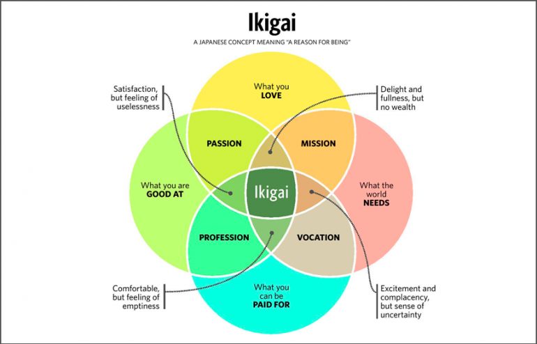

# Ikigai

DevOps playground.
## Introduction

Welcome to my personal Ikigai project repository dedicated to honing my DevOps skills while embodying the principles of the Ikigai philosophy. Just as Ikigai represents the convergence of passion, mission, vocation, and profession, this repository seeks to unite my passion for coding and my commitment to continuous learning, while contributing to the greater DevOps community.

Ikigai is a Japanese concept that means your "reason for being." "Iki" in Japanese means "life", and "gai" describes value or worth. Your ikigai is your life purpose or your bliss. It's what brings you joy and inspires you to get out of bed every day.

The Westernized version of ikigai says you’ve found your dream career when your career includes these four qualities:

- What you love.
- What you’re good at.
- What you can be paid for.
- What the world needs.

This repo and all the others referenced here try to encompass that philosophy and serve as a way for me to play/practice/learn/show everything related to the DevOps work I do.

**Project Objectives:**

1. **Skill Enhancement:** This repository serves as a sandbox for mastering DevOps practices and tools. Expect to find code, configurations, and scripts that illustrate various aspects of continuous integration, continuous delivery, infrastructure as code, containerization, and more.

2. **Collaborative Learning:** Collaboration is at the heart of both DevOps and Ikigai philosophy. Feel free to fork, contribute, and collaborate on this project. By working together, we can collectively enhance our skills and achieve greater outcomes.

3. **Documentation:** Clear documentation is essential in both DevOps and Ikigai. You'll find detailed README files, code comments, and guides to ensure that everything in this repository is understandable and accessible to everyone.

4. **Experimentation:** DevOps is all about experimentation and improvement. This repository will include experimental features and configurations to explore new DevOps trends and best practices.

**Key Features:**

- **CI/CD Pipelines:** A collection of CI/CD pipelines for different types of applications and services, demonstrating automated testing, building, and deployment.

- **Infrastructure as Code (IaC):** Infrastructure provisioning and management code using tools like Terraform, Ansible, or CloudFormation.

- **Containerization:** Examples of Dockerfiles and Kubernetes configurations for containerized applications.

- **Monitoring and Logging:** Integrations with monitoring and logging solutions for observability and incident response.

- **Security Practices:** DevOps security configurations and best practices for application and infrastructure security.

## Description

Every folder has a different project with a README.md explaining what it does.

## Credits

I've read many books, articles, tutorials, courses, etc. over the years to learn and improve my knowledge about technology.
Some resources that helped me a lot are:

[Modern Software Engineering: Doing What Works to Build Better Software Faster by David Farley](https://www.amazon.co.uk/gp/product/B09GG6XKS4/ref=x_gr_bb_amazon?ie=UTF8&tag=x_gr_bb_amazon-21&linkCode=as2&camp=1634&creative=6738)

[Continuous Delivery Pipelines: How To Build Better Software Faster by David Farley](https://www.amazon.co.uk/gp/product/B096YGZVZ9/ref=x_gr_bb_amazon?ie=UTF8&tag=x_gr_bb_amazon-21&linkCode=as2&camp=1634&creative=6738)

[Practice of System and Network Administration Volume 1 by Christina J. Hogan and Tom Limoncelly](https://www.amazon.co.uk/Practice-System-Network-Administration-Enterprise-ebook/dp/B01MFCSNQZ/ref=sr_1_2?crid=3G3MWUR5BGIIT&keywords=practice+of+Cloud+System+Administration+volume+1&qid=1694258973&sprefix=practice+of+cloud+system+administration+volume+1%2Caps%2C109&sr=8-2)

[Practice of System and Network Administration Volume 2 by Christina J. Hogan and Tom Limoncelly](https://www.amazon.co.uk/Practice-Cloud-System-Administration-Practices-ebook/dp/B00N7N2CRQ/ref=sr_1_17?keywords=cloud+engineering&qid=1694258924&sprefix=cloud+engine%2Caps%2C125&sr=8-17)

[Code: The Hidden Language of Computer Hardware and Software by Charles Petzold](https://www.amazon.co.uk/gp/product/B0B123P5GV/ref=x_gr_bb_amazon?ie=UTF8&tag=x_gr_bb_amazon-21&linkCode=as2&camp=1634&creative=6738)

[The Unicorn Project by Gene Kim](https://www.amazon.co.uk/gp/product/1942788762/ref=x_gr_bb_amazon?ie=UTF8&tag=x_gr_bb_amazon-21&linkCode=as2&camp=1634&creative=6738)

[Site Reliability Engineering: How Google Runs Production Systems by Betsy Beyer, Chris Jones](https://www.amazon.co.uk/gp/product/B01DCPXKZ6/ref=x_gr_bb_amazon?ie=UTF8&tag=x_gr_bb_amazon-21&linkCode=as2&camp=1634&creative=6738)

[The Site Reliability Workbook: Practical Ways to Implement SRE by Betsy Beyer, Niall Richard Murphy](https://www.amazon.co.uk/gp/product/1492029505/ref=x_gr_bb_amazon?ie=UTF8&tag=x_gr_bb_amazon-21&linkCode=as2&camp=1634&creative=6738)

[Continuous Delivery: Reliable Software Releases through Build, Test, and Deployment Automation by Jex Humble and David Farley](https://www.amazon.co.uk/Continuous-Delivery-Deployment-Automation-Addison-Wesley-ebook/dp/B003YMNVC0/ref=sr_1_1?keywords=continuous+delivery+dave+farley&qid=1694258848&sprefix=continous+del%2Caps%2C114&sr=8-1)

[Release It!: Design and Deploy Production-Ready Software by Michael T. Nygard](https://www.amazon.co.uk/gp/product/0978739213/ref=x_gr_bb_amazon?ie=UTF8&tag=x_gr_bb_amazon-21&linkCode=as2&camp=1634&creative=6738)

[The Kubernetes Book by Nigel Poulton](https://www.amazon.co.uk/Kubernetes-Book-Version-November-2018-ebook/dp/B072TS9ZQZ/ref=sr_1_3?crid=XHDVEYEZDZHB&keywords=kubernetes&qid=1694258881&sprefix=kuben%2Caps%2C150&sr=8-3)

[DevOps: A Software Architect's Perspective by Len Bass, Ingo Weber, Liming Zhu](https://www.amazon.co.uk/gp/product/B00XCF9VCI/ref=x_gr_bb_amazon?ie=UTF8&tag=x_gr_bb_amazon-21&linkCode=as2&camp=1634&creative=6738)

[Beyond The Phoenix Project: The Origins and Evolution Of DevOps by Gene Kim, John Willis](https://www.amazon.co.uk/gp/product/B079V4YRG1/ref=x_gr_bb_amazon?ie=UTF8&tag=x_gr_bb_amazon-21&linkCode=as2&camp=1634&creative=6738)

[Terraform: Up and Running: Writing Infrastructure as Code by Yevgeniy Brikman](https://www.amazon.co.uk/Terraform-Up-Running-Yevgeniy-Brikman-ebook/dp/B0BFVT6XS4/ref=tmm_kin_swatch_0?_encoding=UTF8&qid=1694353112&sr=8-1)

[UNIX and Linux System Administration Handbook by Evi Nemeth, Garth Snyder](https://www.amazon.co.uk/UNIX-Linux-System-Administration-Handbook-ebook/dp/B075MK6LZ7/ref=sr_1_1?keywords=UNIX+and+Linux+System+Administration+Handbook&qid=1694353184&s=books&sr=1-1)

[The Phoenix Project: A Novel About IT, DevOps, and Helping Your Business Win by Gene Kim, Kevin Behr](https://www.amazon.co.uk/gp/product/0988262592/ref=x_gr_bb_amazon?ie=UTF8&tag=x_gr_bb_amazon-21&linkCode=as2&camp=1634&creative=6738)

## License

Distributed under the Apache 2 License.

## Technology stack

